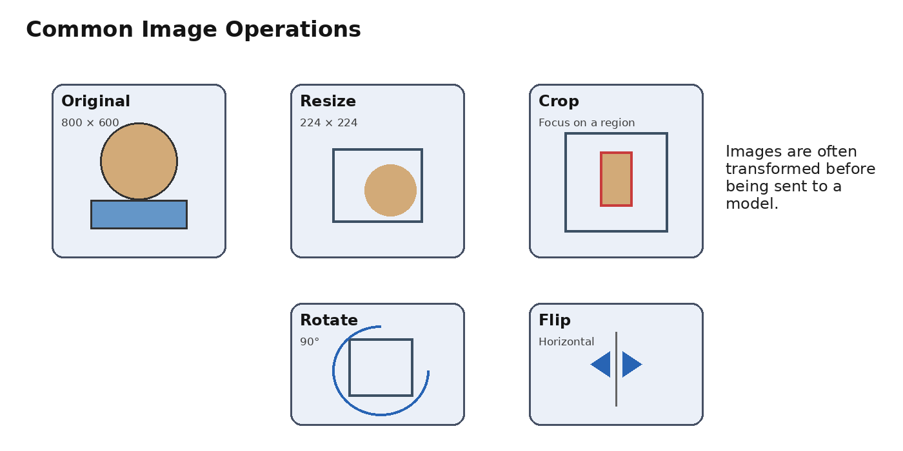
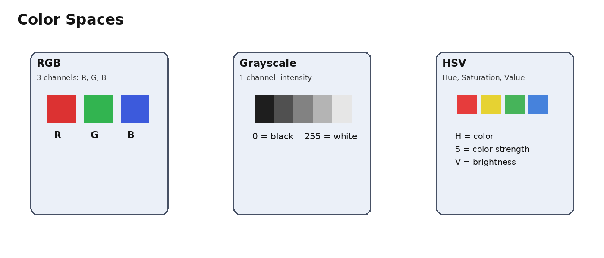
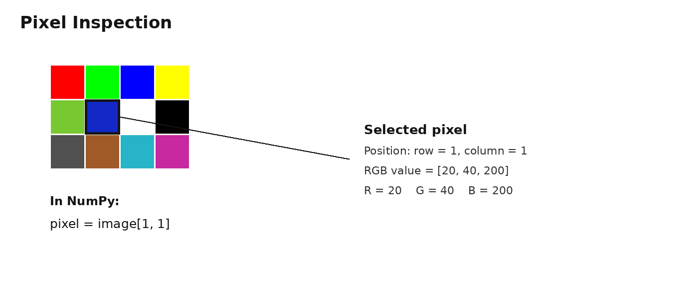

# Image Operations & Visualization

This section introduces the most common operations used when working with images in **Computer Vision**.

The main goals are to:

- Modify images before using them.
- Prepare images for Machine Learning and Deep Learning models.
- Understand image dimensions and pixel values.
- Visualize images and compare transformations.
- Analyze pixel distributions using histograms.
- Inspect individual pixels.

---

## 1. Image Operations

Image operations are transformations applied to an image to change its **size, shape, orientation, values, or color representation**.

### 1.1 Resize

**Resize** changes the dimensions of an image.

For example:

```text
Original: 800 × 600 × 3
        ↓ Resize
New:      224 × 224 × 3
```



### Why do we resize images?

Deep Learning models usually expect all images in a batch to have the same spatial dimensions.

For example:

```text
Image 1 → 500 × 300
Image 2 → 800 × 600
Image 3 → 224 × 224
```

These images cannot normally be stacked directly into one tensor.

We can resize them to:

```text
224 × 224
224 × 224
224 × 224
```

### Example with PIL

```python
from PIL import Image

image = Image.open("cat.jpg")
image = image.resize((224, 224))
```

### Important: Aspect Ratio

If the original image has a different aspect ratio, directly resizing it to a square can distort the image.

```text
800 × 400
   ↓
224 × 224
```

The object may become stretched or compressed.

---

## 1.2 Crop

**Crop** means taking only a specific region of an image and removing the rest.

Example:

```text
Original image
      ↓
 Select a region
      ↓
Cropped image
```

Cropping is useful when:

- We want to focus on an object.
- We want to remove unnecessary areas.
- We want to create training examples.
- We want a specific image size.
- We want to perform data augmentation.

### Common cropping methods

**Center Crop**

Takes a region from the center of the image.

**Random Crop**

Takes a random region from the image and is commonly used for **Data Augmentation**.

---

## 1.3 Rotate

**Rotation** changes the orientation of an image by a specific angle.

Common rotations include:

```text
90°
180°
270°
45°
```

Example:

```python
image = image.rotate(90)
```

### Why is rotation useful?

Rotation can be used as **Data Augmentation**.

For example, if a model is trained only on objects in one orientation, it may struggle when the object appears at a slightly different angle.

Rotation helps the model learn more robust visual features.

---

## 1.4 Flip

**Flip** creates a mirror-like version of an image.

### Horizontal Flip

Swaps the left and right sides.

```text
Left ↔ Right
```

Example:

```python
image.transpose(Image.FLIP_LEFT_RIGHT)
```

### Vertical Flip

Swaps the top and bottom.

Example:

```python
image.transpose(Image.FLIP_TOP_BOTTOM)
```

### Important

Not every image should be flipped.

For example, flipping:

- Text
- Some road signs
- Some medical images
- Objects with a fixed orientation

may change the meaning or create unrealistic training examples.

---

## 1.5 Normalize

Normalization changes the numerical range of pixel values.

For a typical 8-bit image:

```text
Pixel values:
0 → 255
```

A common normalization is:

```text
normalized_pixel = pixel / 255
```

So:

```text
120 / 255 ≈ 0.47
200 / 255 ≈ 0.78
50  / 255 ≈ 0.20
```

Therefore:

```text
[120, 200, 50]
        ↓
[0.47, 0.78, 0.20]
```

### Why normalize?

Neural networks generally train more effectively when input values are in a suitable numerical range.

---

### Standardization

Another common approach is standardization:

```text
x_normalized = (x - mean) / std
```

Where:

- `mean` = average value
- `std` = standard deviation

In PyTorch, you may see:

```python
transforms.Normalize(
    mean=[0.485, 0.456, 0.406],
    std=[0.229, 0.224, 0.225]
)
```

For RGB images, a separate mean and standard deviation are usually applied to each channel.

---

## 1.6 Convert Color Spaces

A **color space** is a way of representing colors numerically.

Common color spaces in Computer Vision include:

- RGB
- Grayscale
- HSV



---

### RGB

RGB represents an image using three channels:

```text
R → Red
G → Green
B → Blue
```

A single pixel can be:

```text
[255, 0, 0]
```

This represents pure red.

A typical RGB image has:

```text
Height × Width × 3
```

For example:

```text
224 × 224 × 3
```

---

### Grayscale

A grayscale image has only one channel.

Pixel values usually range from:

```text
0 → Black
255 → White
```

Example:

```text
Pixel = 120
```

The image shape becomes:

```text
224 × 224
```

instead of:

```text
224 × 224 × 3
```

With PIL:

```python
gray = image.convert("L")
```

`L` represents a grayscale/luminance image.

---

### HSV

HSV stands for:

```text
H → Hue
S → Saturation
V → Value
```

#### Hue

Represents the type of color:

```text
Red
Green
Blue
...
```

#### Saturation

Represents how strong or pure the color is.

#### Value

Represents brightness.

HSV is useful in tasks such as:

- Color detection
- Object segmentation
- Image processing

---

# 2. Image Visualization

Visualization means displaying and analyzing images so we can understand what the computer is processing.

---

## 2.1 Displaying Images

Using Matplotlib:

```python
import matplotlib.pyplot as plt

plt.imshow(image)
plt.show()
```

For a grayscale image:

```python
plt.imshow(gray, cmap="gray")
plt.show()
```

The `cmap="gray"` tells Matplotlib to display the image using a grayscale colormap.

---

## 2.2 Displaying Multiple Images

We often need to compare several versions of an image.

For example:

```text
Original | Resized | Grayscale
```

Using Matplotlib:

```python
plt.subplot(1, 3, 1)
plt.imshow(image)
plt.axis("off")

plt.subplot(1, 3, 2)
plt.imshow(resized)
plt.axis("off")

plt.subplot(1, 3, 3)
plt.imshow(gray, cmap="gray")
plt.axis("off")

plt.show()
```

### Understanding `subplot`

```python
plt.subplot(1, 3, 1)
```

means:

```text
1 Row
3 Columns
Position 1
```

So the layout is:

```text
+----------+----------+----------+
| Image 1  | Image 2  | Image 3  |
+----------+----------+----------+
```

This is especially useful for comparing:

- Original vs augmented images
- RGB vs grayscale
- Before vs after preprocessing

---

# 3. Histograms

A **histogram** shows the distribution of pixel values in an image.

For a grayscale image, pixel values normally range from:

```text
0 → 255
```

A histogram answers questions such as:

> How many pixels have a value close to 0?

> How many pixels have a value around 100?

> How many pixels have a value close to 255?


### Histogram axes

**X-axis:**

```text
Pixel Intensity
0 → 255
```

**Y-axis:**

```text
Number of Pixels
```

### Dark image

If an image contains mostly dark pixels, the histogram will have more values toward the left.

```text
0                         255
|██████████                |
```

### Bright image

If an image contains mostly bright pixels, the histogram will have more values toward the right.

```text
0                         255
|                █████████|
```

---

## RGB Histogram

For an RGB image, we can analyze each channel separately:

```text
Red Histogram
Green Histogram
Blue Histogram
```

Each channel contains values from:

```text
0 → 255
```

This can help us understand the color distribution of an image.

---

# 4. Pixel Inspection

**Pixel inspection** means checking the exact value of a specific pixel.

This is useful for:

- Debugging
- Understanding image representation
- Checking preprocessing
- Understanding RGB channels



Suppose an RGB image has:

```text
224 × 224 × 3
```

We can inspect the pixel at:

```text
row = 100
column = 50
```

Using NumPy:

```python
pixel = image[100, 50]
```

The result could be:

```python
[120, 200, 50]
```

This means:

```text
R = 120
G = 200
B = 50
```

---

## Grayscale Pixel

For a grayscale image:

```text
224 × 224
```

We can write:

```python
pixel = gray[100, 50]
```

The result could be:

```text
120
```

This means the pixel has a grayscale intensity of `120`.

---

# 5. Image Dimensions in Computer Vision

One of the most important concepts is understanding how image dimensions are represented.

### Common representation

Many image-processing libraries use:

```text
Height × Width × Channels
```

Example:

```text
224 × 224 × 3
```

This is common when working with:

- PIL
- NumPy
- OpenCV

### PyTorch representation

PyTorch commonly uses:

```text
Channels × Height × Width
```

So:

```text
3 × 224 × 224
```

When working with a batch:

```text
Batch × Channels × Height × Width
```

Example:

```text
32 × 3 × 224 × 224
```

This means:

```text
32 images
3 channels
224 height
224 width
```

---

# 6. Complete Image Preprocessing Pipeline

A typical Computer Vision pipeline can look like this:

```text
                 Image
                   ↓
          Resize / Crop / Flip
                   ↓
            Color Conversion
                   ↓
               Normalize
                   ↓
             Visualization
                   ↓
        Pixel / Histogram Analysis
                   ↓
             CNN / Deep Learning
                   ↓
                Output
```

The goal is to transform raw images into a representation that is suitable for analysis and Machine Learning models.

---

# 7. Quick Summary

| Operation | Purpose |
|---|---|
| **Resize** | Change image dimensions |
| **Crop** | Keep a selected region |
| **Rotate** | Change image orientation |
| **Flip** | Mirror the image |
| **Normalize** | Scale/standardize pixel values |
| **Color Space Conversion** | Convert RGB, Grayscale, HSV, etc. |
| **Display Image** | Visualize an image |
| **Multiple Images** | Compare image versions |
| **Histogram** | Analyze pixel-value distribution |
| **Pixel Inspection** | Inspect an individual pixel |

---

## Key Idea

The most important thing to understand is:

> **An image is data. Image operations modify that data, while visualization helps us understand what the data contains.**

Before sending an image to a CNN, we commonly perform operations such as:

```text
Raw Image
   ↓
Resize
   ↓
Crop / Augmentation
   ↓
Convert / Transform
   ↓
Normalize
   ↓
Tensor
   ↓
CNN
```

This is the foundation for understanding image preprocessing in **Computer Vision and Deep Learning**.
