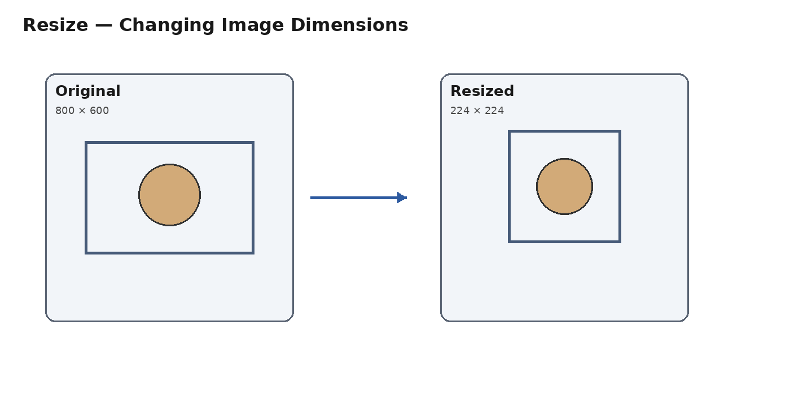
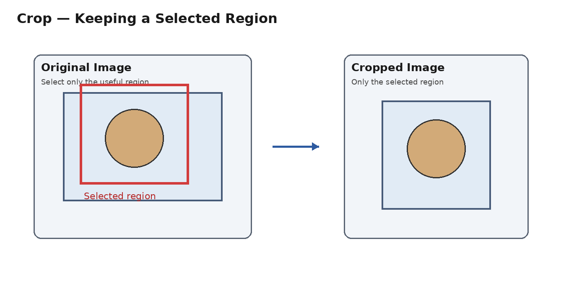
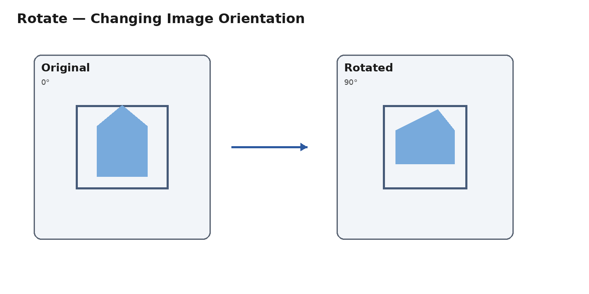
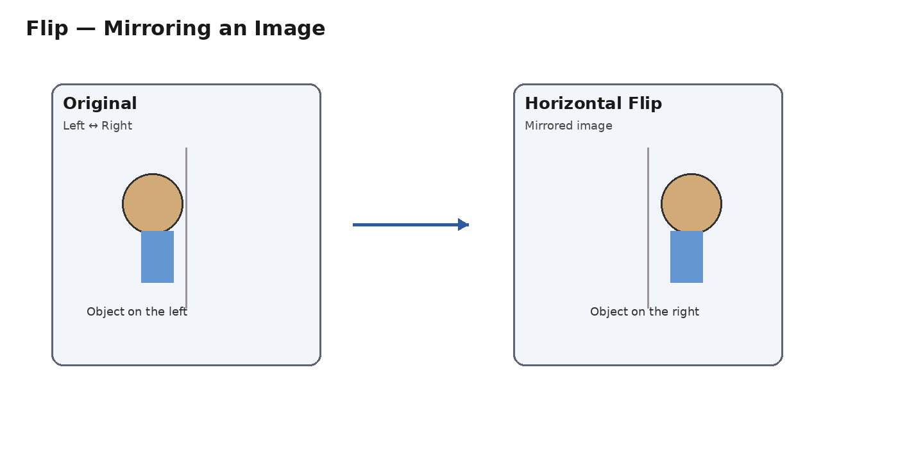
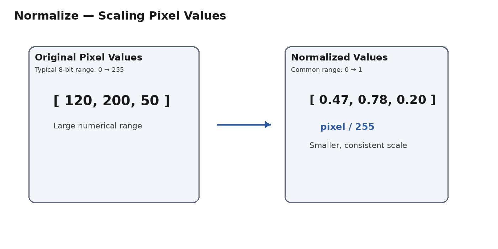
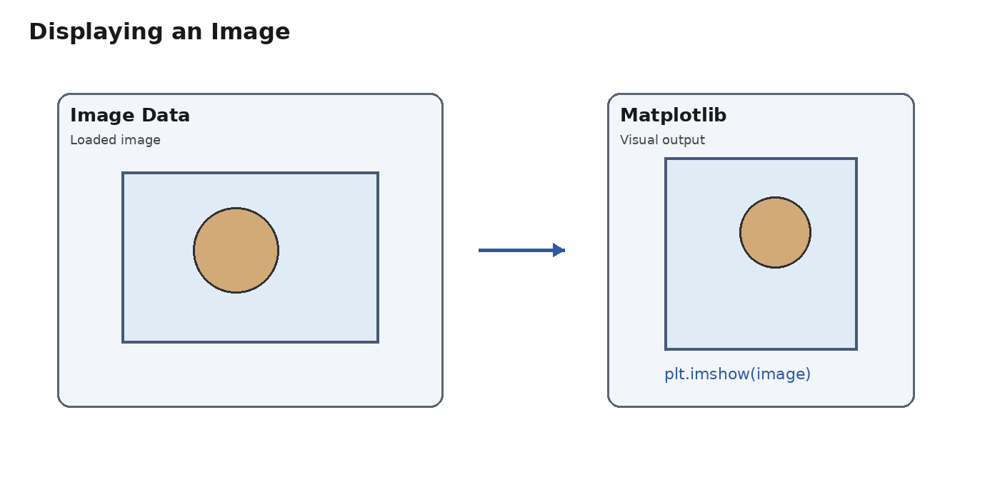
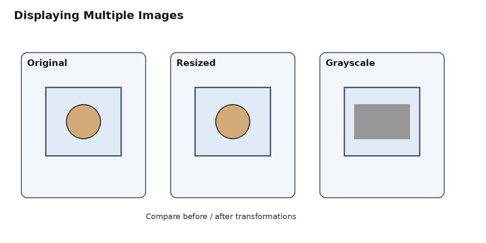
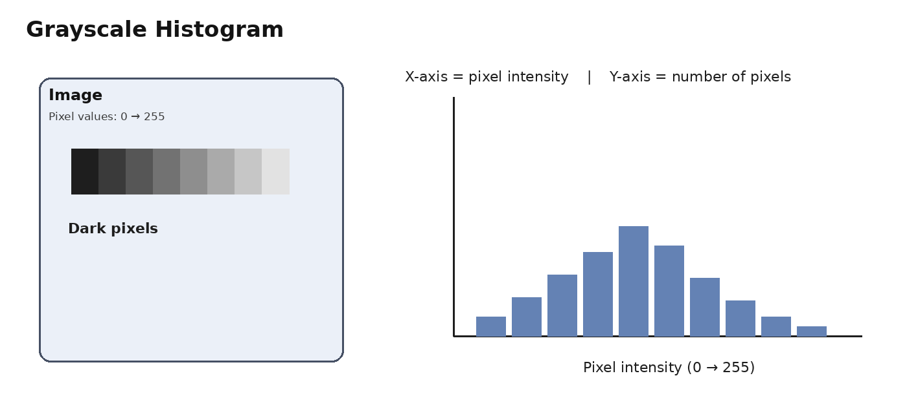
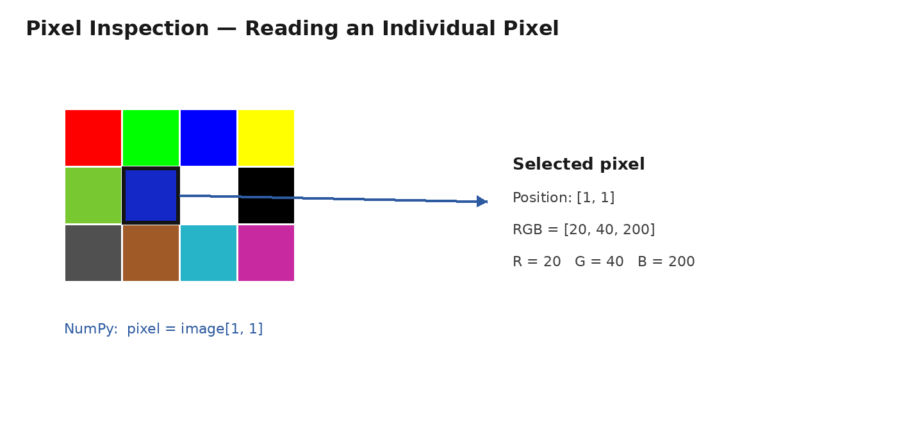

# Computer Vision — Image Operations & Visualization

This lecture introduces the most important operations used to **prepare, transform, visualize, and analyze images** before using them in Computer Vision and Deep Learning.

---

# 1.5 Image Operations

Image operations are transformations applied to an image to change its **size, region, orientation, pixel values, or color representation**.

## 1. Resize



**Resize** changes the dimensions of an image.

For example:

```text
Original: 800 × 600 × 3
      ↓ Resize
New:      224 × 224 × 3
```

### Why do we resize?

Deep Learning models usually require images in a consistent size so they can be processed together in batches.

For example:

```text
Image 1 → 500 × 300
Image 2 → 800 × 600
Image 3 → 224 × 224
```

We can resize them to:

```text
224 × 224
224 × 224
224 × 224
```

### Python example

```python
from PIL import Image

image = Image.open("cat.jpg")
image = image.resize((224, 224))
```

### Important: Aspect Ratio

Directly changing an image from:

```text
800 × 400
```

to:

```text
224 × 224
```

can distort the object because the width and height are scaled differently.

---

## 2. Crop



**Crop** means keeping only a selected region of an image and removing the rest.

### Why do we crop?

Cropping is useful when we want to:

- Focus on an important object.
- Remove unnecessary areas.
- Extract a region of interest.
- Create training examples.
- Perform data augmentation.

### Common types

**Center Crop:** Takes the center region.

**Random Crop:** Takes a random region and is commonly used for **Data Augmentation**.

---

## 3. Rotate



**Rotation** changes the orientation of an image by a specific angle.

Common angles include:

```text
90°
180°
270°
45°
```

### Python example

```python
image = image.rotate(90)
```

### Why use rotation?

Rotation is commonly used as **Data Augmentation**.

It helps a model learn that an object can appear at different orientations.

For example:

```text
Original Image
      ↓
   Rotate
      ↓
New Training Example
```

---

## 4. Flip



**Flip** creates a mirrored version of an image.

### Horizontal Flip

Changes:

```text
Left ↔ Right
```

Example:

```python
image.transpose(Image.FLIP_LEFT_RIGHT)
```

### Vertical Flip

Changes:

```text
Top ↔ Bottom
```

Example:

```python
image.transpose(Image.FLIP_TOP_BOTTOM)
```

### Important

Not every image should be flipped.

For example, flipping text, some road signs, or images with a fixed orientation may create unrealistic data.

---

## 5. Normalize



**Normalization** changes the numerical range of pixel values.

A typical 8-bit image has:

```text
0 → 255
```

A common normalization is:

```text
normalized_pixel = pixel / 255
```

For example:

```text
[120, 200, 50]
       ↓
[0.47, 0.78, 0.20]
```

### Why normalize?

Neural networks generally train more effectively when input values have a suitable and consistent numerical scale.

### Standardization

Another common method is:

```text
x_normalized = (x - mean) / std
```

In PyTorch, you may see:

```python
transforms.Normalize(
    mean=[0.485, 0.456, 0.406],
    std=[0.229, 0.224, 0.225]
)
```

For RGB images, each channel can have its own mean and standard deviation.

---

## 6. Convert Color Spaces


A **color space** is a numerical way of representing colors.

Common color spaces include:

```text
RGB
Grayscale
HSV
```

### RGB

RGB uses three channels:

```text
R → Red
G → Green
B → Blue
```

A pixel can be:

```python
[255, 0, 0]
```

which represents pure red.

An RGB image commonly has:

```text
Height × Width × 3
```

For example:

```text
224 × 224 × 3
```

### Grayscale

A grayscale image uses one channel.

Typical values are:

```text
0   → Black
255 → White
```

In PIL:

```python
gray = image.convert("L")
```

The shape becomes:

```text
224 × 224
```

instead of:

```text
224 × 224 × 3
```

### HSV

HSV stands for:

```text
H → Hue
S → Saturation
V → Value
```

- **Hue:** Type of color.
- **Saturation:** Strength or purity of the color.
- **Value:** Brightness.

HSV can be useful for color detection and image segmentation.

---

# 1.6 Image Visualization

Visualization helps us **see and understand the image data** that a computer is processing.

---

## 7. Displaying Images



We can display an image using Matplotlib:

```python
import matplotlib.pyplot as plt

plt.imshow(image)
plt.show()
```

For grayscale images:

```python
plt.imshow(gray, cmap="gray")
plt.show()
```

`cmap="gray"` tells Matplotlib to display the image using a grayscale colormap.

---

## 8. Displaying Multiple Images



Sometimes we need to compare several images or several versions of the same image.

For example:

```text
Original | Resized | Grayscale
```

Using Matplotlib:

```python
plt.subplot(1, 3, 1)
plt.imshow(image)
plt.axis("off")

plt.subplot(1, 3, 2)
plt.imshow(resized)
plt.axis("off")

plt.subplot(1, 3, 3)
plt.imshow(gray, cmap="gray")
plt.axis("off")

plt.show()
```

### Understanding `subplot`

```python
plt.subplot(1, 3, 1)
```

means:

```text
1 Row
3 Columns
Position 1
```

So the layout is:

```text
+----------+----------+----------+
| Image 1  | Image 2  | Image 3  |
+----------+----------+----------+
```

This is very useful for comparing **before and after preprocessing**.

---

## 9. Histograms



A **histogram** shows the distribution of pixel values in an image.

For a grayscale image, pixel values normally range from:

```text
0 → 255
```

A histogram tells us:

> How many pixels have each intensity value?

### Histogram axes

**X-axis:**

```text
Pixel Intensity
0 → 255
```

**Y-axis:**

```text
Number of Pixels
```

### Dark image

If an image contains mostly dark pixels, the histogram tends to have more values toward the left.

```text
0                         255
|██████████                |
```

### Bright image

If an image contains mostly bright pixels, the histogram tends to have more values toward the right.

```text
0                         255
|                █████████|
```

### RGB Histogram

For an RGB image, we can analyze the channels separately:

```text
Red Histogram
Green Histogram
Blue Histogram
```

This helps us understand the distribution of colors in the image.

---

## 10. Pixel Inspection



**Pixel inspection** means checking the exact value of a specific pixel.

This is useful for:

- Debugging.
- Understanding image representation.
- Checking preprocessing.
- Understanding RGB channels.

Suppose we have:

```text
224 × 224 × 3
```

We can inspect a pixel at:

```text
row = 100
column = 50
```

Using NumPy:

```python
pixel = image[100, 50]
```

The result might be:

```python
[120, 200, 50]
```

This means:

```text
R = 120
G = 200
B = 50
```

### Grayscale Pixel

For a grayscale image:

```python
pixel = gray[100, 50]
```

The result could be:

```text
120
```

This is the intensity of that pixel.

---

# Image Dimensions in Computer Vision

One important concept is the order of image dimensions.

### PIL / NumPy / OpenCV

Images are commonly represented as:

```text
Height × Width × Channels
```

Example:

```text
224 × 224 × 3
```

### PyTorch

PyTorch commonly uses:

```text
Channels × Height × Width
```

Example:

```text
3 × 224 × 224
```

For a batch:

```text
Batch × Channels × Height × Width
```

Example:

```text
32 × 3 × 224 × 224
```

This means:

```text
32 images
3 channels
224 height
224 width
```

---

# Complete Image Preprocessing Flow

```text
                 Raw Image
                     ↓
            Resize / Crop
                     ↓
           Rotate / Flip
                     ↓
          Color Conversion
                     ↓
              Normalize
                     ↓
             Visualization
                     ↓
       Histogram / Pixel Inspection
                     ↓
                Tensor
                     ↓
                  CNN
                     ↓
                 Output
```

---

# Quick Summary

| Operation | Purpose |
|---|---|
| **Resize** | Change image dimensions |
| **Crop** | Keep a selected region |
| **Rotate** | Change image orientation |
| **Flip** | Mirror the image |
| **Normalize** | Scale pixel values |
| **Color Space Conversion** | Convert RGB, Grayscale, HSV, etc. |
| **Display Image** | Visualize an image |
| **Multiple Images** | Compare image versions |
| **Histogram** | Analyze pixel-value distribution |
| **Pixel Inspection** | Inspect an individual pixel |

## Key Idea

> **An image is data. Image operations modify that data, while visualization helps us understand what the data contains.**

These concepts form the foundation of **Image Preprocessing** before an image is passed to a CNN or another Computer Vision model.
