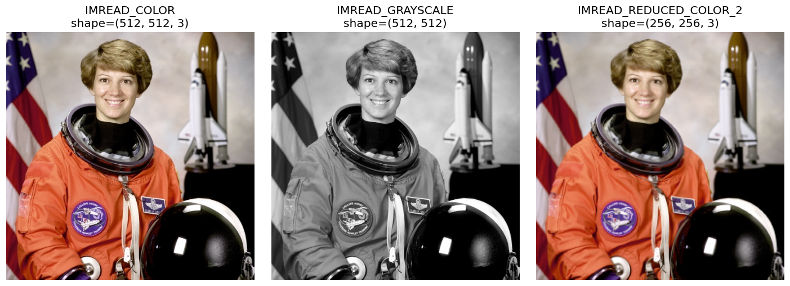
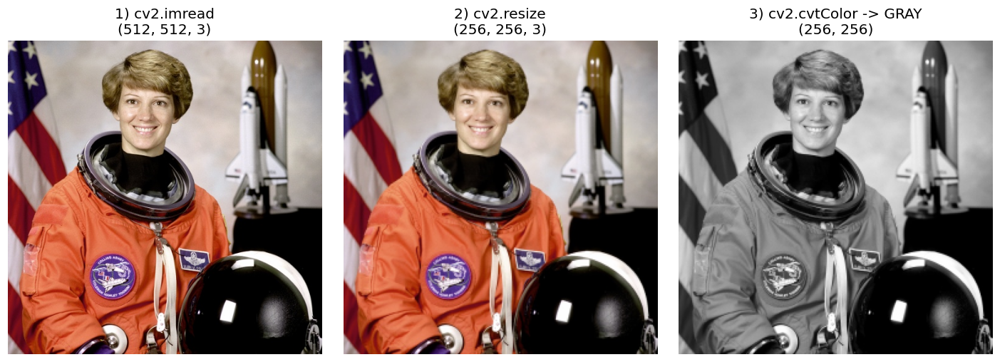
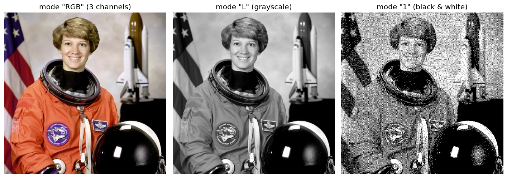
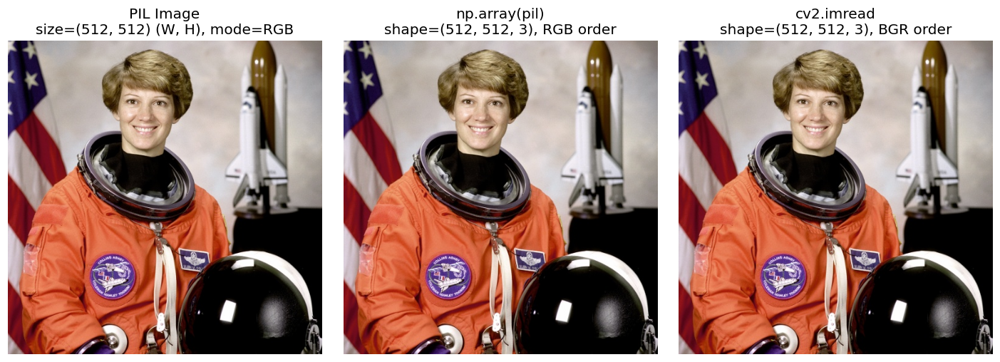
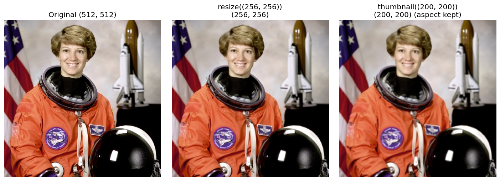
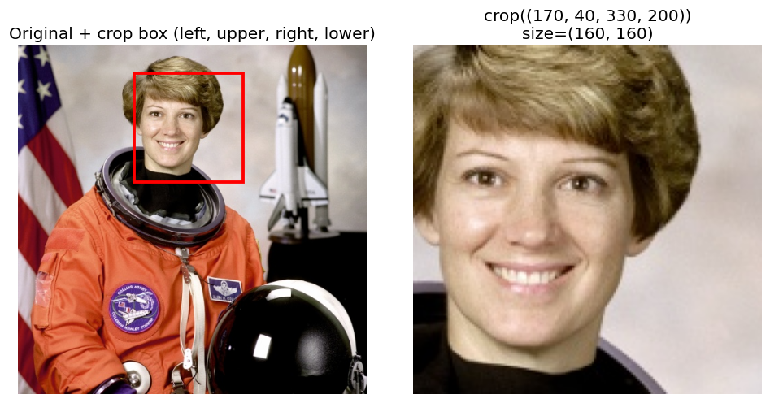
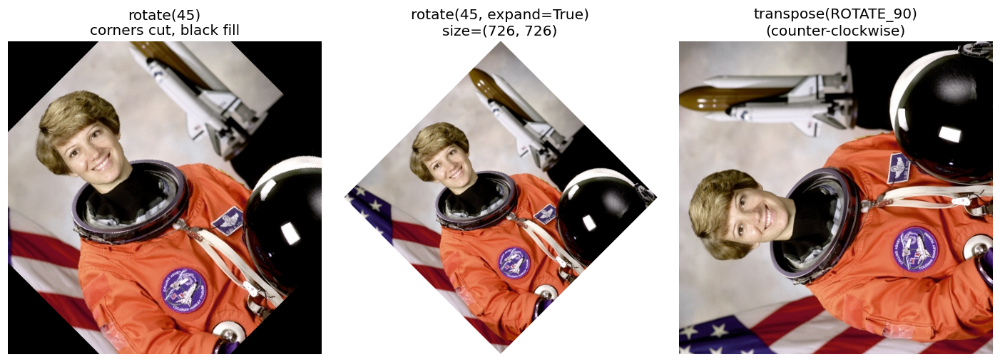
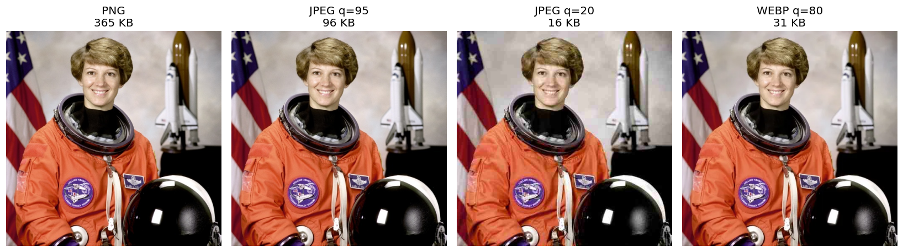

# Computer Vision — Image Operations & Visualization

In this lecture we learn the basic operations we apply to images **before** feeding them to any model, and how to **look at** images and their data to understand what is going on.

> All examples use one sample image: `images/sample.jpg` (the "astronaut" image from scikit-image, public domain, 512×512).

## Table of Contents

**1.5 Image Operations**
1. [Resize](#1-resize)
2. [Crop](#2-crop)
3. [Rotate](#3-rotate)
4. [Flip](#4-flip)
5. [Normalize](#5-normalize)
6. [Convert Color Spaces](#6-convert-color-spaces)

**1.6 Image Visualization**
1. [Displaying Images](#1-displaying-images)
2. [Displaying Multiple Images](#2-displaying-multiple-images)
3. [Histograms](#3-histograms)
4. [Pixel Inspection](#4-pixel-inspection)

**1.7 Introduction to OpenCV**
1. [Installing OpenCV](#installing-opencv)
2. [cv2.imread()](#cv2imread-read-an-image)
3. [cv2.imshow()](#cv2imshow-display-an-image-in-a-window)
4. [cv2.imwrite()](#cv2imwrite-save-an-image)
5. [cv2.resize() and cv2.cvtColor()](#cv2resize-and-cv2cvtcolor-in-a-pipeline)

**1.8 PIL / Pillow**
1. [Opening images](#opening-images)
2. [RGB conversion](#rgb-conversion)
3. [Resize](#resize)
4. [Crop](#crop)
5. [Rotate](#rotate)
6. [Saving images](#saving-images)

---

## Setup

```bash
pip install opencv-python numpy matplotlib
```

```python
import cv2
import numpy as np
import matplotlib.pyplot as plt

img = cv2.imread("images/sample.jpg")   # loaded as a NumPy array
print(img.shape, img.dtype)             # (512, 512, 3) uint8
```

### Important: an image is just a NumPy array

- Shape is `(height, width, channels)`, so the **first index is the row (y)** and the second is the **column (x)**.
- Each value is `uint8`: an integer from `0` (black) to `255` (white).
- **OpenCV loads color images as BGR, not RGB.** Matplotlib expects RGB. If you display a BGR image directly, the colors look wrong (red and blue are swapped).


```python
img_rgb = cv2.cvtColor(img, cv2.COLOR_BGR2RGB)   # use this for plt.imshow
```

---

# 1.5 Image Operations

## 1. Resize

**What it is:** changing the width and height of an image.

**Why we need it:** most models require a fixed input size (e.g. 224×224). Smaller images are also faster to process.

**How to choose the interpolation method:** when pixels are created or removed, OpenCV has to estimate new pixel values.

| Method | Best for |
|---|---|
| `cv2.INTER_AREA` | **Shrinking** images (best quality) |
| `cv2.INTER_LINEAR` | General use (default) |
| `cv2.INTER_CUBIC` | **Enlarging** images (smoother, slower) |
| `cv2.INTER_NEAREST` | Fastest, blocky result (keeps hard edges) |


```python
# Resize to an exact size. NOTE: the order is (width, height)
small = cv2.resize(img, (128, 128), interpolation=cv2.INTER_AREA)

# Resize by a scale factor (keeps the aspect ratio)
half = cv2.resize(img, None, fx=0.5, fy=0.5, interpolation=cv2.INTER_AREA)

# Enlarge: compare two interpolation methods
big_nearest = cv2.resize(small, (512, 512), interpolation=cv2.INTER_NEAREST)  # blocky
big_cubic   = cv2.resize(small, (512, 512), interpolation=cv2.INTER_CUBIC)    # smooth

print(img.shape, "->", small.shape)   # (512, 512, 3) -> (128, 128, 3)
```

> **Common mistake:** `img.shape` is `(height, width)` but `cv2.resize` takes `(width, height)`.

---

## 2. Crop

**What it is:** keeping only a rectangular region of the image (Region of Interest, ROI).

**Why we need it:** remove useless background, focus on the object (a face, a license plate), or cut an image into patches.

**How it works:** there is no special function. Since the image is a NumPy array, cropping is just **slicing**: `img[y1:y2, x1:x2]`.


```python
y1, y2 = 40, 200      # rows    (top to bottom)
x1, x2 = 170, 330     # columns (left to right)

crop = img[y1:y2, x1:x2]
print(crop.shape)     # (160, 160, 3)

# Use .copy() if you want to modify the crop without changing the original
crop = img[y1:y2, x1:x2].copy()
```

> **Remember:** slicing returns a *view*, not a copy. Changing `crop` changes `img` unless you call `.copy()`.

---

## 3. Rotate

**What it is:** turning the image around a point by some angle.

**Why we need it:** fixing wrongly oriented photos, and **data augmentation** (making the model robust to rotated objects).

**Two ways:**
1. `cv2.rotate`: fast, only for 90°, 180°, 270° with no quality loss.
2. `cv2.warpAffine`: any angle, using a rotation matrix. With arbitrary angles the corners get cut off unless we enlarge the output canvas.


```python
# 1) Fixed angles
rot90 = cv2.rotate(img, cv2.ROTATE_90_CLOCKWISE)
# also: cv2.ROTATE_180, cv2.ROTATE_90_COUNTERCLOCKWISE

# 2) Any angle
h, w = img.shape[:2]
center = (w // 2, h // 2)
M = cv2.getRotationMatrix2D(center, angle=45, scale=1.0)   # positive angle = counter-clockwise
rotated = cv2.warpAffine(img, M, (w, h))                   # corners are cut off

# 3) Any angle WITHOUT cutting the corners: enlarge the canvas first
cos, sin = abs(M[0, 0]), abs(M[0, 1])
new_w = int(h * sin + w * cos)
new_h = int(h * cos + w * sin)
M[0, 2] += new_w / 2 - center[0]
M[1, 2] += new_h / 2 - center[1]
rotated_full = cv2.warpAffine(img, M, (new_w, new_h))
```

---

## 4. Flip

**What it is:** mirroring the image.

**Why we need it:** another very common **data augmentation**. A flipped cat is still a cat.

| `flipCode` | Effect |
|---|---|
| `1` | Horizontal (left ↔ right) |
| `0` | Vertical (top ↕ bottom) |
| `-1` | Both |


```python
flip_h    = cv2.flip(img, 1)    # horizontal
flip_v    = cv2.flip(img, 0)    # vertical
flip_both = cv2.flip(img, -1)   # both

# Same thing with NumPy slicing
flip_h_np = img[:, ::-1]        # reverse the columns
flip_v_np = img[::-1, :]        # reverse the rows
```

> **Be careful:** flipping is not always safe. Flipping text or digits (6 vs 9, or letters) changes the meaning.

---

## 5. Normalize

**What it is:** changing the range of pixel values, usually from `[0, 255]` to a smaller range.

**Why we need it:** neural networks train **faster and more stably** when inputs are small and centered around zero. Large values like 255 make gradients unstable.

**Two common types:**
1. **Scaling to [0, 1]:** divide by 255.
2. **Standardization (mean/std):** subtract the mean and divide by the std for each channel. Pretrained models (e.g. ResNet on ImageNet) expect the ImageNet mean/std shown below.


The image looks almost the same, but the **numbers** (see the histograms in the second row) have a totally different range.

```python
img_rgb = cv2.cvtColor(img, cv2.COLOR_BGR2RGB)

# 1) Scale to [0, 1]
img_01 = img_rgb.astype(np.float32) / 255.0
print(img_01.min(), img_01.max())          # 0.0 1.0

# 2) Standardize with ImageNet mean/std (per channel, RGB order)
mean = np.array([0.485, 0.456, 0.406], dtype=np.float32)
std  = np.array([0.229, 0.224, 0.225], dtype=np.float32)
img_std = (img_01 - mean) / std
print(img_std.min(), img_std.max())        # roughly -2.1 to 2.6

# 3) Min-Max normalization (stretch to the full [0, 1] range)
img_minmax = cv2.normalize(img_rgb, None, 0, 1, cv2.NORM_MINMAX, dtype=cv2.CV_32F)
```

> **Common mistake:** convert to `float32` **before** dividing. If you stay in `uint8` the result is wrong. Also, the mean/std order must match the channel order (RGB vs BGR).

---

## 6. Convert Color Spaces

**What it is:** representing the same image with different channels.

**Why we need it:** each color space makes a different task easier.

| Color space | Channels | Useful for |
|---|---|---|
| **RGB / BGR** | Red, Green, Blue | Display, deep learning input |
| **Grayscale** | 1 channel (brightness) | Faster processing, edge detection, when color is not needed |
| **HSV** | Hue, Saturation, Value | **Color-based segmentation** (e.g. "find all red objects"), because color (H) is separated from brightness (V) |
| **LAB** | Lightness, a, b | Color comparison closer to human perception |


```python
gray = cv2.cvtColor(img, cv2.COLOR_BGR2GRAY)   # shape (512, 512), a single channel
hsv  = cv2.cvtColor(img, cv2.COLOR_BGR2HSV)
lab  = cv2.cvtColor(img, cv2.COLOR_BGR2LAB)

print(img.shape, gray.shape)   # (512, 512, 3) (512, 512)
```

### Splitting channels

Each channel is just a grayscale image showing "how much" of that component each pixel has. Bright = high value.


```python
b, g, r = cv2.split(img)                  # OpenCV order is B, G, R
h, s, v = cv2.split(hsv)

merged = cv2.merge([b, g, r])             # put them back together
```

> **Note on HSV in OpenCV:** Hue goes from `0` to `179` (not 360), while S and V go from `0` to `255`.

---

# 1.6 Image Visualization

## 1. Displaying Images

**Why it matters:** in computer vision you constantly need to *see* the result of every step to catch mistakes early.

**Using Matplotlib** (works in Jupyter and Colab):

```python
plt.imshow(cv2.cvtColor(img, cv2.COLOR_BGR2RGB))   # convert BGR -> RGB first
plt.title("Original image")
plt.axis("off")                                     # hide the axes
plt.show()
```

**Grayscale images** have a single channel, so Matplotlib colors them with a default colormap (viridis, greenish) unless you set `cmap="gray"`:


```python
plt.imshow(gray, cmap="gray")       # correct for grayscale
plt.show()
```

**Using OpenCV windows** (only in normal Python scripts, **not** Jupyter/Colab):

```python
cv2.imshow("Image", img)    # OpenCV expects BGR, so no conversion needed
cv2.waitKey(0)              # wait for any key
cv2.destroyAllWindows()
```

> In Google Colab use `from google.colab.patches import cv2_imshow` and `cv2_imshow(img)`, or just use Matplotlib.

---

## 2. Displaying Multiple Images

**Why it matters:** comparing "before vs after" is the best way to check that an operation did what you expected.

**How it works:** `plt.subplots(rows, cols)` creates a grid of axes, and we draw one image in each.


```python
images = [
    ("Original",    cv2.cvtColor(img, cv2.COLOR_BGR2RGB), None),
    ("Grayscale",   gray,                                  "gray"),
    ("Flipped",     cv2.cvtColor(cv2.flip(img, 1), cv2.COLOR_BGR2RGB), None),
    ("Cropped",     cv2.cvtColor(crop, cv2.COLOR_BGR2RGB), None),
    ("Rotated 90°", cv2.cvtColor(cv2.rotate(img, cv2.ROTATE_90_CLOCKWISE), cv2.COLOR_BGR2RGB), None),
    ("Blurred",     cv2.cvtColor(cv2.GaussianBlur(img, (15, 15), 0), cv2.COLOR_BGR2RGB), None),
]

fig, axes = plt.subplots(2, 3, figsize=(12, 8))
for ax, (title, image, cmap) in zip(axes.ravel(), images):
    ax.imshow(image, cmap=cmap)
    ax.set_title(title)
    ax.axis("off")

plt.tight_layout()
plt.show()
```

> Images can have different sizes in the grid. Matplotlib scales each one to fit its own axes.

---

## 3. Histograms

**What it is:** a chart that counts **how many pixels have each intensity value** (0 to 255).

**How to read it:**
- Peak on the **left** → dark image.
- Peak on the **right** → bright image.
- Values squeezed in a **narrow range** → low contrast.
- Spread over the **whole range** → good contrast.

**Why we need it:** judging exposure and contrast, choosing thresholds, and comparing images.


```python
# Grayscale histogram
plt.hist(gray.ravel(), bins=256, range=(0, 256), color="gray")
plt.xlabel("Pixel value")
plt.ylabel("Count")
plt.show()

# Color histogram: one curve per channel
for i, color in enumerate(["b", "g", "r"]):
    hist = cv2.calcHist([img], [i], None, [256], [0, 256])
    plt.plot(hist, color=color, label=color.upper())
plt.legend()
plt.show()
```

### Histogram Equalization

Spreads the pixel values over the full range, which **boosts contrast** in dull images. Notice how the histogram becomes wider and flatter:


```python
equalized = cv2.equalizeHist(gray)    # works on single-channel (grayscale) images only
```

---

## 4. Pixel Inspection

**What it is:** reading (or changing) the actual values of specific pixels.

**Why we need it:** to *understand* that an image is just numbers, to debug (is the range 0-255 or 0-1? BGR or RGB?), and to check that an operation changed what you expect.


```python
row, col = 100, 250

# Color image: returns all 3 channels (B, G, R)
print(img[row, col])            # [24 43 64]

# A single channel of that pixel
print(img[row, col, 0])         # Blue value -> 24

# Grayscale image: returns one number
print(gray[row, col])           # 47

# Look at a small neighborhood (9x9 patch around the pixel)
patch = gray[row-4:row+5, col-4:col+5]
print(patch)

# Change a pixel (or a region) directly
img_copy = img.copy()
img_copy[100:120, 250:270] = (0, 0, 255)    # paint a red square (BGR)
```

### Useful image statistics

```python
print("Shape :", img.shape)          # (512, 512, 3)
print("Dtype :", img.dtype)          # uint8
print("Min   :", img.min())
print("Max   :", img.max())
print("Mean per channel (B,G,R):", img.mean(axis=(0, 1)))
```

> **Remember:** index order is `[row, col]` = `[y, x]`. This is the opposite of what we usually write for coordinates `(x, y)`.

---

# 1.7 Introduction to OpenCV

**What it is:** OpenCV (Open Source Computer Vision Library) is the most widely used library for image and video processing. It is written in C++ (so it is fast) and has a Python interface called `cv2`.

**What it gives us:** reading and writing images, resizing, color conversion, filtering, edge detection, feature detection, video processing, and much more.

## Installing OpenCV

```bash
# Standard version (includes cv2.imshow windows)
pip install opencv-python

# Headless version: for servers, Docker, and Colab (no GUI windows)
pip install opencv-python-headless
```

> Install **only one** of them in the same environment. Having both causes conflicts.

Verify the installation:

```python
import cv2
print(cv2.__version__)    # e.g. 4.13.0
```

> The package is named `opencv-python` but you import it as `cv2`.

---

## `cv2.imread()`: Read an image

**What it does:** loads an image from disk and returns it as a NumPy array in **BGR** order.

```python
img = cv2.imread("images/sample.jpg")
print(type(img))     # <class 'numpy.ndarray'>
print(img.shape)     # (512, 512, 3)
print(img.dtype)     # uint8
```

**The second argument (flag)** controls *how* the image is loaded:

| Flag | Value | Result |
|---|---|---|
| `cv2.IMREAD_COLOR` | `1` | 3 channels BGR (default, drops transparency) |
| `cv2.IMREAD_GRAYSCALE` | `0` | 1 channel grayscale |
| `cv2.IMREAD_UNCHANGED` | `-1` | Keeps the file as is (including the alpha/transparency channel in PNGs) |
| `cv2.IMREAD_REDUCED_COLOR_2` | | Loads at half size (faster for huge images) |



```python
color = cv2.imread("images/sample.jpg", cv2.IMREAD_COLOR)
gray  = cv2.imread("images/sample.jpg", cv2.IMREAD_GRAYSCALE)
half  = cv2.imread("images/sample.jpg", cv2.IMREAD_REDUCED_COLOR_2)

print(color.shape, gray.shape, half.shape)
# (512, 512, 3) (512, 512) (256, 256, 3)
```

> **Common mistake:** if the path is wrong, `cv2.imread` does **not** raise an error. It silently returns `None`, and you only get an error later (e.g. `'NoneType' object has no attribute 'shape'`). Always check:

```python
img = cv2.imread("images/sample.jpg")
if img is None:
    raise FileNotFoundError("Could not read the image. Check the path.")
```

---

## `cv2.imshow()`: Display an image in a window

**What it does:** opens a window and shows the image. It expects **BGR**, so there is no need to convert.

```python
cv2.imshow("My Image", img)    # (window title, image)
cv2.waitKey(0)                 # wait until any key is pressed (0 = forever)
cv2.destroyAllWindows()        # close all windows
```

- `cv2.waitKey(0)` is **required**. Without it the window flashes and closes immediately.
- `cv2.waitKey(1000)` waits 1000 ms (1 second), then continues.
- `cv2.imshow` works in normal Python scripts only. It does **not** work in Jupyter or Colab, so use `plt.imshow` there (see section 1.6) or `from google.colab.patches import cv2_imshow`.

```python
# Close the window only when the user presses 'q'
cv2.imshow("My Image", img)
while True:
    if cv2.waitKey(1) & 0xFF == ord("q"):
        break
cv2.destroyAllWindows()
```

---

## `cv2.imwrite()`: Save an image

**What it does:** writes an image to disk. The **file extension decides the format** (`.jpg`, `.png`, `.bmp`, ...).

```python
success = cv2.imwrite("output.png", img)
print(success)    # True if saved, False if it failed
```

**Controlling quality / compression:**

```python
# JPEG: quality from 0 (worst, smallest) to 100 (best, largest). Default is 95.
cv2.imwrite("q95.jpg", img, [cv2.IMWRITE_JPEG_QUALITY, 95])
cv2.imwrite("q10.jpg", img, [cv2.IMWRITE_JPEG_QUALITY, 10])

# PNG: compression from 0 (fast, big) to 9 (slow, small). It is lossless either way.
cv2.imwrite("out.png", img, [cv2.IMWRITE_PNG_COMPRESSION, 9])
```


| Format | Type | Use it for |
|---|---|---|
| **PNG** | Lossless (exact pixels), bigger files | Screenshots, masks, anything you will process again |
| **JPEG** | Lossy (loses some detail), small files | Photos, sharing, storage |

> **Remember:** every time you re-save a JPEG you lose a bit more quality. Save intermediate results as PNG.
> Also, `cv2.imwrite` expects **BGR**. If you converted to RGB for display, convert back before saving.

---

## `cv2.resize()` and `cv2.cvtColor()` in a pipeline

We covered both in detail in section 1.5. Here is how they work together with `imread` and `imwrite` in a typical preprocessing pipeline:



```python
# 1) Read
img = cv2.imread("images/sample.jpg")

# 2) Resize (width, height)
resized = cv2.resize(img, (256, 256), interpolation=cv2.INTER_AREA)

# 3) Convert color space
gray = cv2.cvtColor(resized, cv2.COLOR_BGR2GRAY)

# 4) Save the result
cv2.imwrite("images/processed_gray.png", gray)

print(img.shape, "->", resized.shape, "->", gray.shape)
# (512, 512, 3) -> (256, 256, 3) -> (256, 256)
```

---

# 1.8 PIL / Pillow

**What it is:** Pillow (the maintained fork of PIL, the Python Imaging Library) is another popular image library. It is simpler and more "Pythonic" than OpenCV, and it is the default image library for many deep learning tools (e.g. `torchvision`, Hugging Face).

**OpenCV vs Pillow:**

| | OpenCV (`cv2`) | Pillow (`PIL`) |
|---|---|---|
| Image object | NumPy array | `Image` object |
| Color order | **BGR** | **RGB** |
| Size order | `shape = (H, W, C)` | `size = (W, H)` |
| Strengths | Computer vision algorithms, video, speed | Simple API, many file formats, easy drawing/text |
| Typical use | Detection, tracking, filtering | Loading data, simple edits, augmentation |

## Installing Pillow

```bash
pip install pillow
```

```python
from PIL import Image      # note: install "pillow", import "PIL"
import PIL
print(PIL.__version__)
```

---

## Opening images

**What it does:** `Image.open()` opens the image and returns an `Image` object (not a NumPy array).

```python
from PIL import Image

pil_img = Image.open("images/sample.jpg")

print(pil_img.size)      # (512, 512)  -> (width, height)
print(pil_img.mode)      # RGB
print(pil_img.format)    # JPEG

pil_img.show()           # opens the image in your default viewer
```

> **Common mistake:** `PIL.size` is `(width, height)`, while `numpy.shape` is `(height, width, channels)`.

> `Image.open()` is *lazy*: it reads the file header first and loads the pixels only when needed. If the path is wrong it **raises** `FileNotFoundError` (unlike `cv2.imread`, which returns `None`).

In Jupyter, just write the variable name on the last line of a cell (`pil_img`) and the image is displayed.

---

## RGB conversion

**What it is:** `image.convert(mode)` changes the image **mode**.

**Why it matters:** images come in different modes. A PNG may be `RGBA` (4 channels) or `P` (palette), and a model expecting 3 channels will crash. Calling `.convert("RGB")` right after opening is a standard safety step.

| Mode | Meaning |
|---|---|
| `"RGB"` | 3 channels (red, green, blue) |
| `"RGBA"` | RGB + alpha (transparency) |
| `"L"` | Grayscale (8-bit) |
| `"1"` | Black & white (1-bit) |



```python
rgb  = pil_img.convert("RGB")    # always safe: guarantees 3 channels
gray = pil_img.convert("L")      # grayscale
bw   = pil_img.convert("1")      # black & white

print(rgb.mode, gray.mode, bw.mode)   # RGB L 1
```

### Converting between Pillow and OpenCV / NumPy

Because the **color orders differ** (RGB in Pillow, BGR in OpenCV), you must convert when moving between them.



```python
import numpy as np
import cv2

# PIL -> NumPy (RGB order)
arr = np.array(pil_img)
print(arr.shape)                              # (512, 512, 3)

# PIL -> OpenCV (needs RGB -> BGR)
cv_img = cv2.cvtColor(np.array(pil_img), cv2.COLOR_RGB2BGR)

# OpenCV -> PIL (needs BGR -> RGB)
cv_img = cv2.imread("images/sample.jpg")
pil_img = Image.fromarray(cv2.cvtColor(cv_img, cv2.COLOR_BGR2RGB))
```

---

## Resize

**Two methods:**
- `resize((w, h))` forces an exact size (may distort the aspect ratio).
- `thumbnail((w, h))` shrinks the image **in place** so it fits inside the box and **keeps the aspect ratio**. It never enlarges.

**Resampling filters:** `Image.Resampling.NEAREST` (fastest), `BILINEAR`, `BICUBIC`, and `LANCZOS` (best quality for shrinking).



```python
# Exact size
resized = pil_img.resize((256, 256), Image.Resampling.LANCZOS)
print(resized.size)      # (256, 256)

# Keep aspect ratio (modifies the image in place, so copy first)
thumb = pil_img.copy()
thumb.thumbnail((200, 200))
print(thumb.size)        # (200, 200) for this square image
```

> `thumbnail()` changes the image itself and returns `None`. Don't write `thumb = thumb.thumbnail(...)`.

---

## Crop

**What it does:** `crop((left, upper, right, lower))` returns the region inside the box. Coordinates are **(x, y)** pixel positions, the opposite order of NumPy slicing.



```python
box = (170, 40, 330, 200)       # (left, upper, right, lower)
cropped = pil_img.crop(box)
print(cropped.size)             # (160, 160)
```

> **Compare with OpenCV:** `img[y1:y2, x1:x2]` in NumPy versus `crop((x1, y1, x2, y2))` in Pillow. Same region, different order.

---

## Rotate

**What it does:** `rotate(angle)` turns the image **counter-clockwise** by `angle` degrees.

- By default the canvas stays the same size, so the corners get cut and the empty areas are filled with black.
- `expand=True` enlarges the canvas so the whole rotated image fits.
- `fillcolor` sets the color of the empty areas.
- For exact 90° steps, `transpose()` is faster and lossless.



```python
r1 = pil_img.rotate(45)                                              # corners cut
r2 = pil_img.rotate(45, expand=True, fillcolor=(255, 255, 255))      # full image, white fill
r3 = pil_img.transpose(Image.Transpose.ROTATE_90)                    # exact 90° (counter-clockwise)

print(r1.size, r2.size)     # (512, 512) (726, 726)
```

> **Careful:** Pillow rotates **counter-clockwise** for positive angles. To rotate clockwise use a negative angle: `rotate(-45)`.

Flipping in Pillow works with `transpose` too:

```python
flip_h = pil_img.transpose(Image.Transpose.FLIP_LEFT_RIGHT)
flip_v = pil_img.transpose(Image.Transpose.FLIP_TOP_BOTTOM)
```

---

## Saving images

**What it does:** `image.save(path)` writes the image. Like OpenCV, the extension decides the format, and you can pass format options.



```python
pil_img.save("output.png")                       # lossless
pil_img.save("output_q95.jpg", quality=95)       # high quality JPEG
pil_img.save("output_q20.jpg", quality=20)       # small file, visible artifacts
pil_img.save("output.webp", quality=80)          # modern format, small size
```

> **Common error:** you cannot save an `RGBA` image as JPEG (JPEG has no transparency). Convert first:
>
> ```python
> pil_img.convert("RGB").save("output.jpg")
> ```

Check the file size to compare formats:

```python
import os
print(os.path.getsize("output.png") / 1024, "KB")
```

---

## Summary

| Operation | Function | Typical use |
|---|---|---|
| Resize | `cv2.resize` | Fixed model input size |
| Crop | `img[y1:y2, x1:x2]` | Focus on a region (ROI) |
| Rotate | `cv2.rotate`, `cv2.warpAffine` | Fix orientation, augmentation |
| Flip | `cv2.flip` | Augmentation |
| Normalize | `/ 255.0`, `(x - mean) / std` | Stable and faster training |
| Color conversion | `cv2.cvtColor` | Grayscale, HSV segmentation, etc. |
| Display | `plt.imshow` | Always convert BGR → RGB |
| Histogram | `cv2.calcHist`, `plt.hist` | Brightness and contrast analysis |
| Pixel access | `img[row, col]` | Debugging and understanding the data |
| Read / show / save | `cv2.imread`, `cv2.imshow`, `cv2.imwrite` | Basic OpenCV I/O (check for `None`!) |
| Pillow open / convert | `Image.open`, `.convert("RGB")` | Safe loading with a guaranteed mode |
| Pillow edit | `.resize`, `.crop`, `.rotate`, `.save` | Simple edits and augmentation |

## Key Takeaways

1. An image is a NumPy array: `(height, width, channels)`, values `0-255`.
2. OpenCV uses **BGR**; Matplotlib uses **RGB**. Always convert before displaying.
3. `cv2.resize` takes `(width, height)`, but array indexing uses `[row, col]`.
4. Convert to `float32` **before** normalizing.
5. Always visualize after each operation to verify the result.
6. `cv2.imread` returns `None` on a wrong path (no error), while `Image.open` raises an exception.
7. OpenCV uses **BGR** and `shape = (H, W, C)`; Pillow uses **RGB** and `size = (W, H)`. Convert when switching libraries.
8. Use PNG for lossless intermediate results and JPEG only for final photos.
